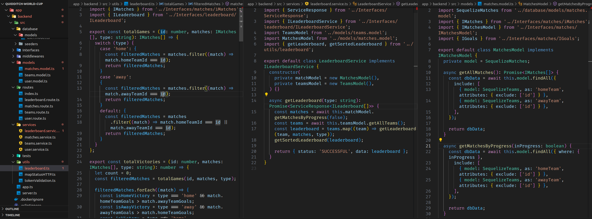

# README: Football Manager



## Project Description

This project aims to bring together all the knowledge acquired so far! The proposal is the creation of an API to be consumed by an front-end. Initially, the application is an informative website about football matches and standings.

### Technologies

- LINUX
- VSCODE
- NODE.JS
- MYSQL
- TYPESCRIPT
- SEQUELIZE
- JSON WEB TOKEN
- CHAI
- SINON
- MOCHA

### What I Learned

- How to do dockerization of apps, network, volume, and compose;
- How to create a REST API following the principles of Object-Oriented Programming (OOP);
- How to develop a CRUD (Create, Read, Update, Delete) using TypeScript, utilizing an Object-Relational Mapping (ORM) approach.

## How to Run the Project

1. Clone the repository:

   ```bash
   git clone https://github.com/feduarte-dev/quidditch-world-cup
   ```

2. Navigate to the project directory:

   ```bash
   cd your-repository
   ```

3. Initiate the containers

   ```bash
   npm run compose:up
   ```
   
4. Install dependencies inside container:

   ```bash
   npm run install:apps
   ```

5. If you want to run tests or check tests coverage:

   ```bash
   cd app/backend
   npm run test
   npm run test:coverage
   ```

## Contributions

[Felipe](https://www.linkedin.com/in/feduarte-dev/) - /backend

[Trybe](https://www.betrybe.com/) - Everything else
